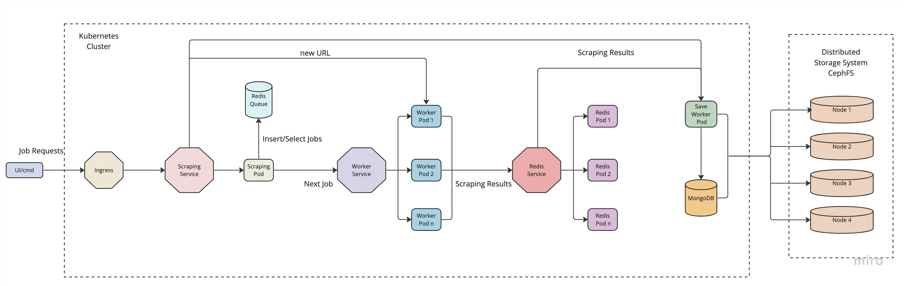

**Design Documentation to Operationalize the Collection of Millions of URLs**

The provided code performs web scraping on specific URLs, extracts text content, tokenizes, and lemmatizes the words. It then uses NMF (Non-negative Matrix Factorization) for topic modeling to identify key topics within the scraped content. 

To operationalize this process for millions of URLs, you will need to take into consideration three major aspects:

1. **Scalability**: How the solution will handle a high volume of URLs.

2. **Reliability**: The solution must ensure that data is accurately scraped and stored. Errors should be handled gracefully and should not cause the system to crash or lose data.

3. **Performance**: The solution must be able to process the URLs quickly and efficiently. 

The following steps can be taken to ensure these aspects:

1. **Parallel Processing/Distributed Scraping**: Scrapy on its own is a single-threaded, asynchronous framework. It's not designed to leverage multi-core machines. To speed up the scraping process for millions of URLs, consider implementing parallel processing by running multiple instances of the scraper across different machines. Tools like Scrapy Cluster can help in this.

2. **Use a Distributed Message Queue**: The use of a distributed message/task queue such as RabbitMQ or Redis can greatly improve the performance and reliability of our data collection process. These tools allow us to distribute tasks across multiple workers, improving efficiency. It also ensures that no data is lost in case of a system crash.

3. **Persistent Storage**: We need a robust and scalable database to store the scraped data and associated metadata. Depending on our needs, we could consider SQL databases like PostgreSQL, or NoSQL options like MongoDB. Be sure to implement an efficient data indexing strategy to optimize data retrieval.

4. **Monitoring and Logging**: Implement thorough logging and real-time monitoring of our scrapers. This will help to quickly identify and rectify any issues that may arise during the scraping process.

5. **Handle Failure & Retry Mechanisms**: Make sure our system is designed to handle possible failures, network issues or changes in the site structure. A good strategy is to implement a retry mechanism for failed requests.

6. **Respectful and Legal Scraping**: Make sure we respect the robots.txt file of the websites we are scraping. Too many requests from a single IP can lead to it being banned. Consider rotating our IP and User-Agent strings. Ensure we comply with the website's terms of service and local laws.

7. **Optimize Text Processing**: NLTK can be slow for processing large amounts of text. Spacy is a faster alternative for text processing and supports parallel processing.

8. **Incremental Scraping**: Instead of scraping the whole data each time, consider scraping new or updated data only. This can be achieved by keeping track of the last scraped URL or by comparing the old and new versions of a webpage.

9. **Efficient Topic Modeling**: Applying NMF for each parsed response could be computationally expensive. Instead, gather a substantial amount of tokens, then run the NMF. For very large scale, consider a more scalable topic modeling technique or use distributed computing frameworks like Apache Spark for ML tasks.

10. **APIs and Web Services**: If the website provides an API, it would be more efficient and respectful to use that instead of scraping. Always check if the website provides a public API or if there are any commercial services available that provide the data we need.

This plan provides a scalable, reliable, and high-performing architecture for operationalizing the collection of millions of URLs. However, the specifics will depend on the exact requirements, budget, infrastructure, and other factors related to our project.

### Architecture Blueprint

### Why Scrapy ?

Scrapy is a popular, powerful, and versatile Python framework for web scraping and crawling. Here's why it's often chosen for these tasks:

1. **Powerful and Fast**: Scrapy is designed to handle large amounts of data and navigate complex websites quickly and efficiently.

2. **Middleware and Extensions Support**: Scrapy supports a large number of middlewares and extensions, and allows the development of custom ones.

3. **Handling of Request/Responses**: Scrapy handles the requests and responses in a very organized way, allowing you to apply pre-processing steps on the responses and handle different error codes without breaking the spider.

4. **Item Pipelines**: Scrapy provides the ability to write pipelines, where you can manipulate the data, validate it, and even store it in any storage system (Database, File, Cloud Storage etc.).

5. **Built-in Support for Selecting and Extracting Data**: Scrapy comes with built-in support for selecting and extracting data from sources either by XPath or CSS expressions.

6. **Robust and Scalable**: Scrapy is designed to be robust and scalable, making it suitable for large scale web scraping tasks and projects.

7. **Broad Community and Good Documentation**: Scrapy has a large community of users and contributors, and its documentation is comprehensive and well-maintained.

So, for tasks involving web scraping, Scrapy is often a top choice due to these robust features. It's especially useful in the context of this code, where it's being used to scrape text data from various web pages for further analysis.

### Why Scrapy Cluster ?

Scrapy Cluster is an extension of the Scrapy framework that allows for a distributed, horizontal scaling architecture, which is beneficial for large-scale web crawling or web scraping projects. Here are a few reasons why you might want to use Scrapy Cluster:

1. **Distributed Crawling**: Scrapy Cluster allows for distributed crawling, meaning that it can manage multiple Scrapy spiders spread across many machines. This makes it much more efficient at gathering data from a large number of websites or pages in a shorter amount of time.

2. **Real-time Crawling**: Scrapy Cluster supports real-time crawling. You can add a new crawl request to the cluster and it will be immediately acted upon, rather than having to wait for all existing tasks to complete.

3. **Failover Handling**: Scrapy Cluster has built-in failover handling. If a spider or a machine fails, the work can be immediately reassigned to another spider or machine, thus ensuring that no data is lost.

4. **Scaling**: Scrapy Cluster supports horizontal scaling. You can add more machines to the cluster to handle increased load, and remove machines when they are no longer needed.

5. **Throttling and Politeness**: Scrapy Cluster respects the rules of web crawling and ensures that your spiders do not overload any single website with too many requests.

6. **Collaborative Crawling**: Because Scrapy Cluster uses a shared queue for URLs to be crawled, it can avoid the issue of multiple spiders crawling the same page.

Scrapy Cluster is a great tool when you have a large amount of data to scrape, and you need a solution that can scale easily to meet demand. It's also useful when you need to spread the load of your scraping across multiple machines, or when you want to add or remove spiders on the fly.

